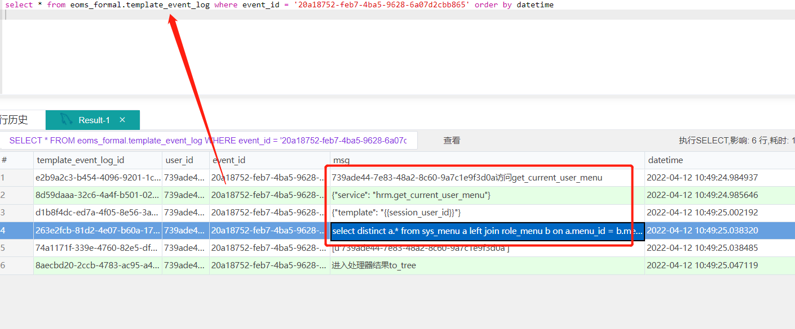
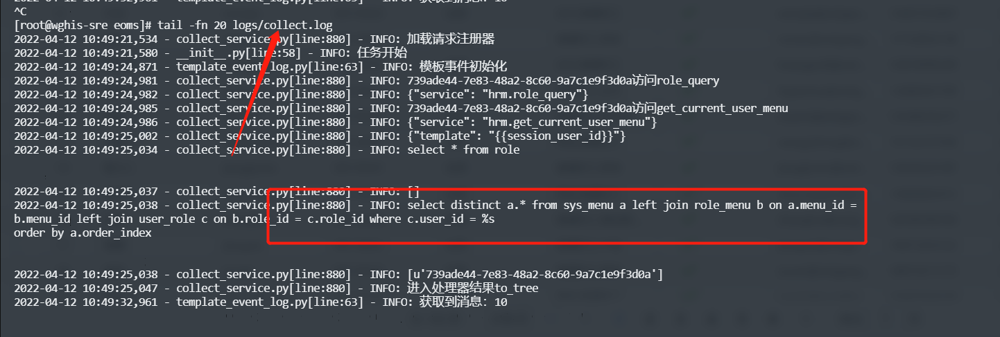
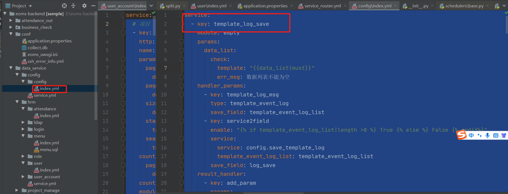
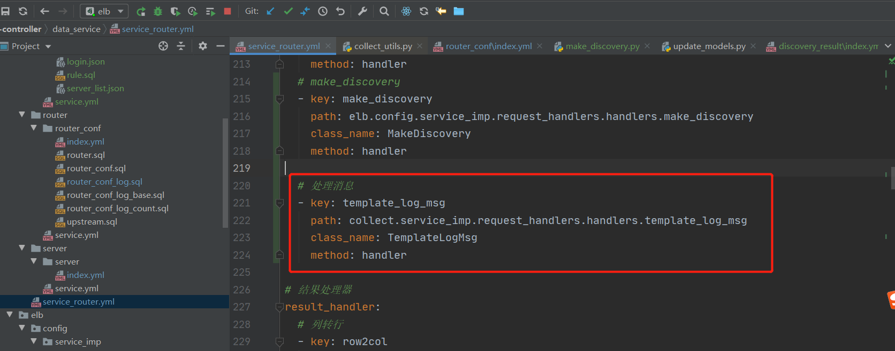

1. log 日志输出
=========================================
针对每个接口，进行配置日志是否输出
     * 支持文件日志输出，保存在logs/collect.log
     * 数据库日志输出,log_handler_service 进行处理，默认存template_event_log

log
>>>>>>>>>>>>>>>>>>>>>>
配置示例
这个是查询sql 配置示例

    .. code-block:: yaml
     :caption: index.yaml

       - key: get_current_user_menu
         http: true
         module: sql
         log: true
         params:
           user_id:
             template: "{{session_user_id}}"
         sql_file: menu.sql
         result_handler:
           - key: to_tree
             params:
               id_field: menu_id
               parent_id_field: parent_id
               children_field: children

配置参数
>>>>>>>>>>>>>>>>>>>>>>
这里解释配置文件application.properties 里面的参数

1. write_file_log
::::::::::::::::::::
是否写文件日志，默认true

2. log_handler_service
::::::::::::::::::::::::::::::::::
日志处理模块，如果为空，就不处理。
log_handler_service=config.template_log_save

注意需要引入config 模块

以及依赖的消息处理器

